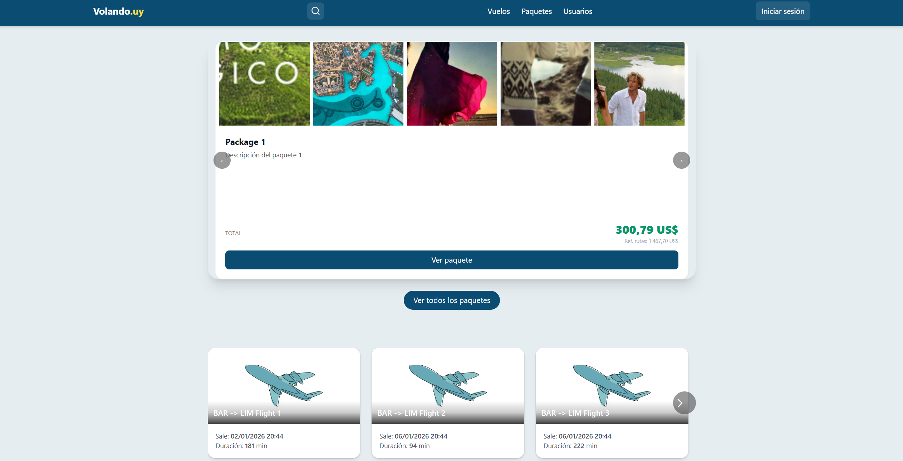

# 🌐 Volando - Módulo Web (Frontend JSP)

Este módulo corresponde a la capa de **presentación web** de la aplicación Volando. Permite a los usuarios interactuar mediante interfaces JSP consumiendo servicios expuestos por el servidor central vía SOAP.

---

## 🧾 Requisitos del sistema

* Java 17+
* Apache Tomcat 9+
* Maven
* PostgreSQL (base de datos `volandodb` debe existir)

---

## 📂 Ruta obligatoria

Este proyecto **debe estar ubicado** en:

```bash
C:\Users\<tu usuario>\volandouy\app-web
```

Y debe coexistir con:

```bash
C:\Users\<tu usuario>\volandouy\app-central
C:\Users\<tu usuario>\volandouy\VolandoApp.exe
```

---

## ⚙️ Configuración (`application.properties`)

Archivo ubicado en:

```bash
src/main/resources/application.properties
```

Contenido:

```properties
# Configuración de la base de datos
db.host=localhost
db.port=5432
db.name=volandodb
db.user=postgres
db.password=admin

# Configuración SOAP
soap.ip=192.168.1.4
soap.port=8086
soap.path=/api

# Endpoints de servicios SOAP (expuestos por el servidor central)
userService.endpoint=http://192.168.1.4:8086/api/userService?wsdl
authService.endpoint=http://192.168.1.4:8086/api/authService?wsdl
bookingService.endpoint=http://192.168.1.4:8086/api/bookingService?wsdl
flightService.endpoint=http://192.168.1.4:8086/api/flightService?wsdl
flightRouteService.endpoint=http://192.168.1.4:8086/api/flightRouteService?wsdl
seatService.endpoint=http://192.168.1.4:8086/api/seatService?wsdl
flightRoutePackageService.endpoint=http://192.168.1.4:8086/api/flightRoutePackageService?wsdl
buyPackageService.endpoint=http://192.168.1.4:8086/api/buyPackageService?wsdl
categoryService.endpoint=http://192.168.1.4:8086/api/categoryService?wsdl
cityService.endpoint=http://192.168.1.4:8086/api/cityService?wsdl
ticketService.endpoint=http://192.168.1.4:8086/api/ticketService?wsdl
imagesService.endpoint=http://192.168.1.4:8086/api/imagesService?wsdl
airportService.endpoint=http://192.168.1.4:8086/api/airportService?wsdl
constantsService.endpoint=http://192.168.1.4:8086/api/constantsService?wsdl
countriesService.endpoint=http://192.168.1.4:8086/api/countriesService?wsdl
pdfService.endpoint=http://192.168.1.4:8086/api/pdfService?wsdl

# Web
cargo.port=8085
```

> ⚠️ Asegúrate de que la IP del servidor central sea correcta. Puede cambiar si no está fija (recomendado usar IP estática o hostname).

---

## 🧠 Estructura General del Proyecto

```bash
📦 app-web/
├── main/
│   ├── java/
│   │   ├── adapters/            # Adaptadores y DTOs del lado cliente
│   │   ├── config/              # Configuración de propiedades
│   │   ├── mappers/             # Conversores entre entidades SOAP y DTOs
│   │   ├── servlets/           # Controladores front-end (JSP + lógica)
│   │   └── utils/              # Utilidades comunes (auth, imágenes, etc.)
│   ├── resources/
│   │   └── application.properties
│   └── webapp/
│       ├── index.jsp           # Página principal
│       ├── styles.css          # Estilos base (más Tailwind)
│       ├── config/             # Config global del sitio (robots.txt)
│       ├── resources/          # JS/CSS externos (FontAwesome, Tailwind, etc.)
│       ├── src/                # Código fuente JSP modular
│       │   ├── components/     # Subcomponentes reusables por secciones
│       │   └── views/          # Vistas JSP completas (login, vuelo, reserva, etc.)
│       └── WEB-INF/
│           └── web.xml         # Configuración del WAR
```

---

## 🔧 Cómo compilar y ejecutar localmente

1. Asegúrate que `app-central` esté corriendo primero (el backend SOAP).
2. Posicionate en la raíz de `app-web`:

```bash
cd C:\Users\<tu usuario>\volandouy\app-web
```

3. Compilar y correr en Tomcat:

```bash
mvn clean package cargo:run
```

4. Accede desde tu navegador:

```
http://localhost:8085/app-web-jsp/
```

---

## 🧱 Arquitectura y comunicación

Esta app-web actúa como **cliente web**:

* Los Servlets JSP capturan acciones del usuario
* Los `SoapServiceFactory` crean clientes SOAP para conectarse al backend central
* Los DTOs adaptan la estructura de los datos entre backend y frontend
* La estructura web está pensada con TailwindCSS + JSP modular

---

## 🧪 Testing Manual

* Se recomienda usar el navegador con DevTools activado
* Validar cada flujo: login, registro, reservas, pagos, perfil, etc.
* Usar Postgres con una base existente `volandodb` para datos persistentes

---

## 📤 Despliegue (manual)

* Generar WAR:

```bash
mvn clean package
```

* Copiar `target/app-web.war` al `webapps/` de Tomcat
* Iniciar el servidor Tomcat

## 📤 Despliegue (automatizado)

* Ejecutar el start-web.bat en la carpeta padre de la aplicacion

---

## 📚 Documentación adicional

* Repositorio central (backend): [`app-central`](../app-central)
* Ejecutable desktop: `VolandoApp.exe`

---

## 🛠️ Mantenimiento

* Validar el archivo `application.properties` al mover la app
* Las IPs y puertos deben coincidir con el entorno real del backend
* El sistema está desacoplado, pero altamente dependiente de los endpoints SOAP


---

